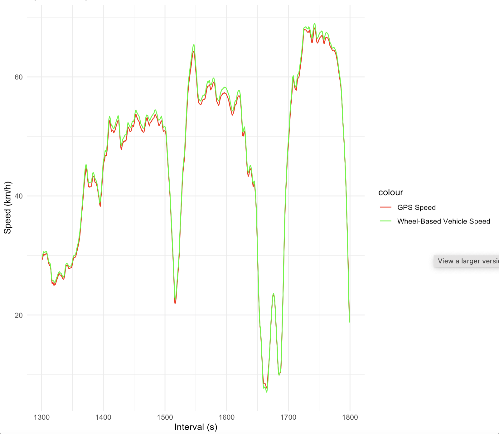
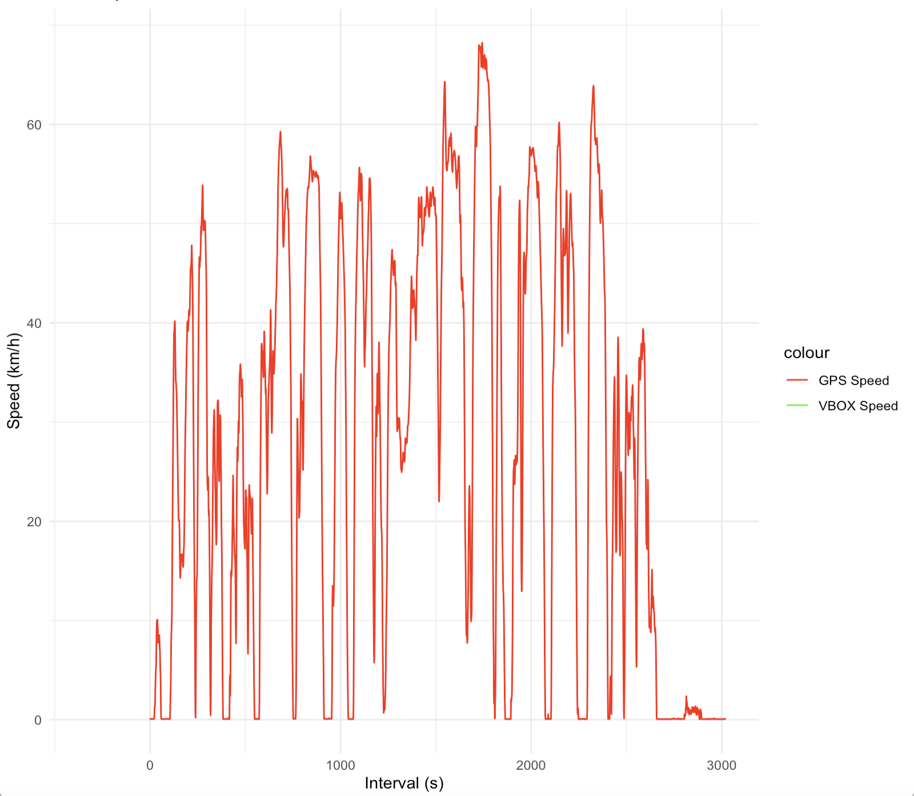

# SQLite High-Resolution Data Processing

## Overview
This folder contains scripts to process raw driving data into a high-resolution SQLite database format. The scripts take in various raw data sources, process them, and store the information in a structured SQLite database, making it easier for analysis and further data processing.

## Scripts Overview
### 1. **SparkfunGPSToSQLite.py**
   - Converts raw GPS data into an SQLite database.
   - Ensures timestamps align with other data sources for synchronization.
   - Saves the data in SparkfunGPSData table

### 2. **CANBinFileToCANDumpFormat.py**
   - Converts raw CAN binary log files into a readable format.
   - Parses and structures the CAN data for further processing.
   - This only needs to be used if the truckcape log file was not usable.

### 3. **CANDataSPNDecoder2023.py**
   - Decodes CAN data using the **J1939 digital annex**.
   - Extracts meaningful parameters (SPNs) from the raw CAN data.

### 4. **CANDataToSQLite.py**
   - Processes and stores CAN data into an SQLite database.
   - Uses decoded data from `CANDataSPNDecoder2023.py`.
   - Saves the data in SPNData table.

### 5. **HeartRateToSQLite.py**
   - Converts raw heart rate data from the **Empatica E4 wristband** into an SQLite format.
   - Synchronizes heart rate timestamps with other datasets.
   - Saves the data in HeartData table.

### 6. **VBOXToSQLite.py**
   - Processes VBOX data (GPS and inertial data) into an SQLite database.
   - Ensures alignment with CAN data timestamps.
   - Saves the data in VBOXData table.

### 7. **FixVBOXTimestamps.py**
   - Adjusts the VBOX timestamps to match CAN data timestamps.
   - Steps:
     1. Copies the first CAN timestamp to VBOX data.
     2. Iterates through possible offsets (-100s to +100s, checking every 0.01s).
     3. Finds the offset with the highest correlation between VBOX speed and CAN speed.
     4. Adjusts all VBOX timestamps accordingly.
   - Most subjects achieved a **0.999 correlation** between VBOX and CAN speed data.
   - Subjects with **missing or low-quality VBOX data**: **G1S15, G1S16, G2S13, G3S13**.
   - Speed Comparison Before Shift
      - 
   - Speed Comparison After Shift
      - 

## Usage Instructions
1. Ensure all raw data files are available.
2. Edit the python files with the correct directories where the files are stored.
3. Run each script in sequence to generate the SQLite database:
   ```bash
   python3 CANBinFileToCANDumpFormat.py <Path to candump file>                             # Convert CAN binary to readable format
   python3 CANDataSPNDecoder2023.py <Path to candump file> <Path to J1939 json file>       # Decodes CAN data
   python3 SparkfunGPSToSQLite.py <Path to candump file>                                   # Store Sparkfun GPS Data
   python3 CANDataToSQLite.py <Path to candump file> <Path to J1939 json file>             # Store CAN data in SQLite
   python3 HeartRateToSQLite.py <Path to EDA file> <Path to HR file> <Path to IBI file>    # Store heart rate data in SQLite
   python3 VBOXToSQLite.py <Path to VBOX file>                                             # Store VBOX data in SQLite
   python3 FixVBOXTimestamps.py                                                            # Adjust VBOX timestamps
   ```
4. The final output after all files have been executed for all 50 participants will be 50 **high-resolution SQLite databases** containing driving data. These will be in 4 tables, SparkfunGPSData, SPNData, HeartData, and VBOXData.


